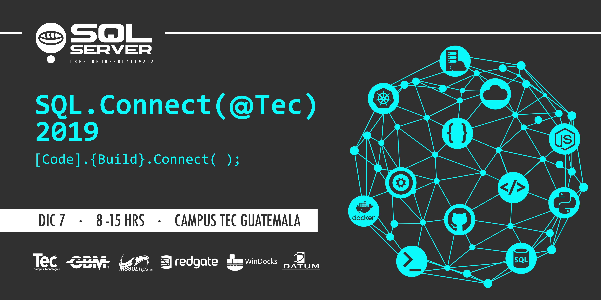

# SQLConnect (@Tec)
```
[Code].{Build}.Connect();
```
# Agenda
## Apertura evento
>**Apertura evento**

Hora | Actividad | Lugar
--- | --- | ---
08:00 - 08:30 | Registro | ::::::::::::::::::::::::::::::::::
08:30 - 08:50 | Bienvenida / Keynote | Auditorio
08:50 - 09:00 | **_[Coffee break](#Comida)_** | ::::::::::::::::::::::::::::::::::

## Primer bloque - 09:00 a 10:00 AM
Lugar | Actividad | Speaker | Track
--- | --- | ---  | ---
Aula Magna | ¿Bases de datos en Azure? | Christian Araujo | [Cloud](#Cloud)
Auditorio | CI/CD para bases de datos | Marcos Cano | [DevOps](#DevOps)

## Segundo bloque - 10:00 a 11:00 AM
Lugar | Actividad | Speaker | Track
--- | --- | ---  | ---
Aula Magna | Introduccion a Azure SQL DB | Marlon Coti | [Cloud](#Cloud)
Auditorio | Microservicios con .NET Core 3 y cómo Dockerizarlos | Geovani De Leon | [DevOps](#DevOps)

## Tercer bloque - 11:00 AM a 12:00 PM
Lugar | Actividad | Speaker | Track
--- | --- | ---  | ---
Aula Magna | Creando un cluster de Kubernetes gratuito! | Alvin Estrada | [DevOps](#DevOps)
Auditorio | SQL Server containers en multiples plataformas | Carlos Lopez | [DevOps](#DevOps)

## Lunch
Hora | Actividad | Lugar
--- | --- | ---
12:00 - 01:00 PM | **_[Lunch](#Comida)_** | Parqueo 2do nivel

## Cuarto bloque 01:00 a 02:00 PM
Lugar | Actividad | Speaker | Track
--- | --- | ---  | ---
Aula Magna| Fundamentos del lenguage T-SQL | Eduardo Pivaral | [Database](#Database)
Auditorio | Piérdele el miedo a los Indices | Mynor Bolanos | [Database](#Database)

## Quinto bloque 02:00 a 03:00 PM
Lugar | Actividad | Speaker | Track
--- | --- | ---  | ---
Aula Magna | Desarrollando serverless apps en Azure Cognitive Services | DATUM | [Cloud](#Cloud)
Auditorio| Transformando applicaciones hacia arquitecturas cloud-native | DATUM | [Cloud](#Cloud)

## Cierre evento
Hora | Actividad | Lugar
--- | --- | ---
03:00 - 03:15 PM | **_[Coffee break](#Comida)_** | ::::::::::::::::::::::::::::::::::
03:15 - 03:30 PM | Cierre del evento / Rifa | Auditorio

# Tracks
## Cloud
Track dedicado a todo lo relacionado a cloud computing
## DevOps
Track dedicado a todo lo relacionado a DevOps
## Database
Track dedicado a todo lo relacionado a bases de datos

# Sponsors

* [Datum](https://www.datum.com.gt/)
* [MSSQL Tips](https://www.mssqltips.com)
* [RedGate](https://www.red-gate.com)
* [Windocks](https://windocks.com)

# Logistica
Gracias al aporte de nuestros sponsors este evento sera **totalmente GRATUITO**, asi que unicamente tienes que asistir al envento!

Estas son algunas consideraciones especiales:

## Parqueo
No abra parqueo de cortesia, recomendamos usar Uber o ya sea parquear a los alrededores de 4 grados norte

## Comida
Tendremos coffee break en el transcurso del dia gracias a GBM.  
Para el almuerzo, te invitamos a desgustar un delicioso Shuko!!

## Rifa
Habran premios para los asistentes del evento, es requisito estar presente durante la rifa.

# Contacto
Para mas informacion y registro de este evento click [aqui](https://sqlconnect_2019.eventbrite.com).  
Seguinos en [Facebook](https://www.facebook.com/groups/gtssug/) para conocer mas acerca de este y otros eventos.
