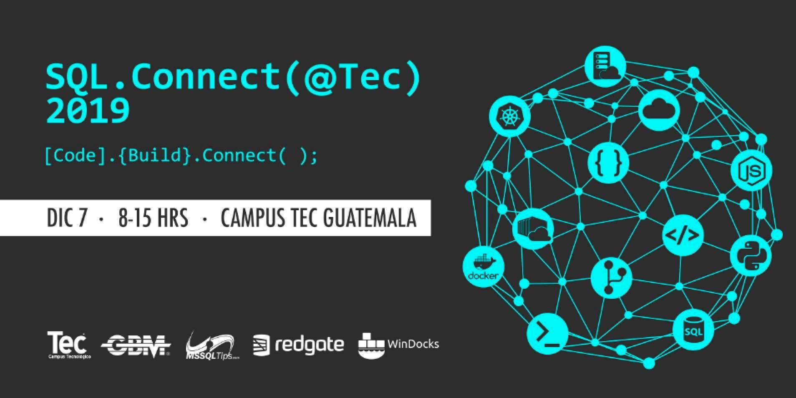

# SQLConnect (@Tec)
```
[Code].{Build}.Connect();
```
# Presentaciones

Sesion | Speaker
--- | --- 
¿Bases de datos en Azure? | [Christian Araujo]()
CI/CD para bases de datos | [Marcos Cano]()
Transformando applicaciones hacia arquitecturas cloud-native | [Rafael Cordon]()
Introduccion a Azure SQL DB | [Marlon Coti]()
Microservicios con .NET Core 3 y cómo Dockerizarlos | [Geovani De Leon]()
Creando un cluster de Kubernetes gratuito! | [Alvin Estrada]()
Desarrollando serverless apps en Azure Cognitive Services | [Mauro Jutzutz ]()
SQL Server containers en multiples plataformas | [Carlos Lopez]()
Fundamentos del lenguage T-SQL | [Eduardo Pivaral]()
Piérdele el miedo a los Indices | [Mynor Bolanos]()

# Dudas o preguntas?
Para mas informacion y registro de este evento click [aqui](https://sqlconnect_2019.eventbrite.com).  
Seguinos en [Facebook](https://www.facebook.com/groups/gtssug/) para conocer mas acerca de este y otros eventos.

# Follow us
[](https://twitter.com/gtssug) [](https://github.com/GTSSUG)[](https://www.facebook.com/groups/gtssug/)
